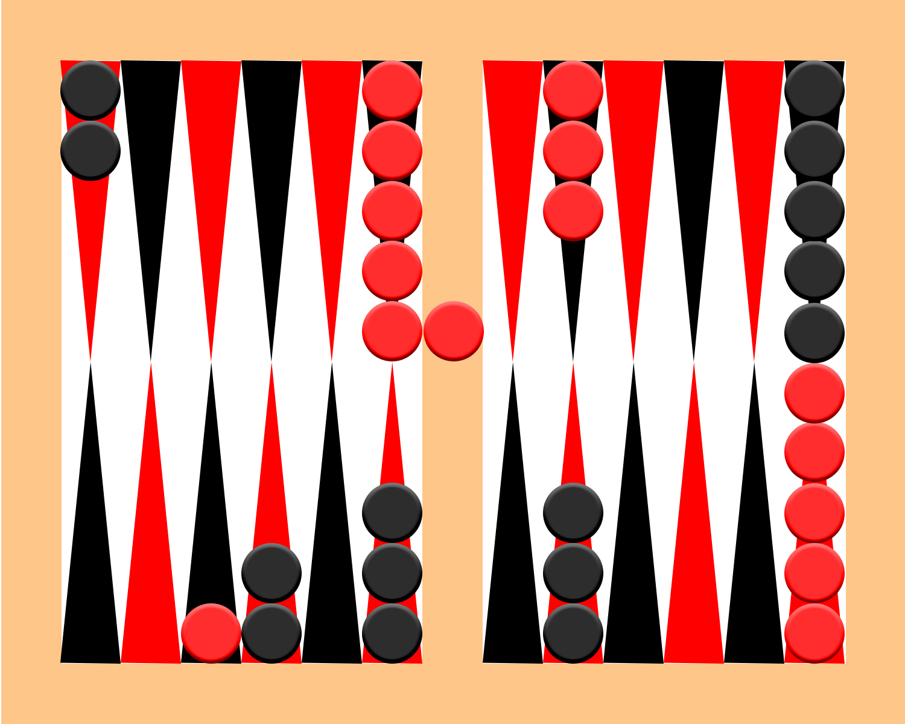

# Backgammon

## Abstract

A browser-implemented backgammon game.

## Definitions

#### Origin

_fig. 1: board setup at game start_

#### Piece Movement

_fig. 2: red rolls [2,3], moves accordingly_

Red moves counter-clockwise, black moves clock-wise.
A piece can move to a space if one of the following is true:
  1. it is empty,
  2. it has the current player's pieces on it,
  3. it has one (and only one) of the other player's pieces. This last behavior results in a _capture_.

#### Capture

_fig. 3: black rolls [2,4], captures red piece_

If a piece is captured, it moves to the center column of the board. It can only be brought back if the captured player rolls into a valid space on the other player's home territory.

#### Game Ending (a.k.a Eating)

If a player's pieces are all within their home territory, the player can start 'eating' their pieces, by taking away pieces from corresponding spaces based on roll. The game ends when all pieces from either opponent's side are 'eaten'.

## Game Logic

At beginning of game, roll to determine who goes first.

The player rolls the dice, then:
  1. If the rolling player has any pieces captured, they must first place their captured piece(s) on an open space.
